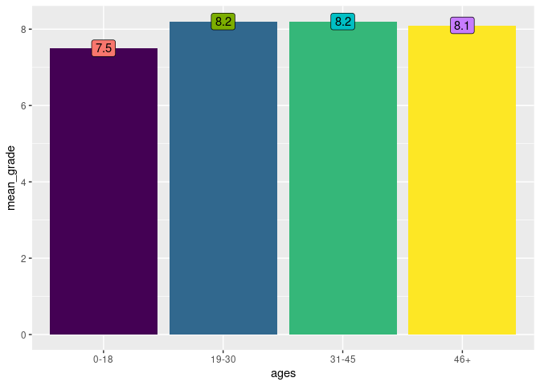

Internet Film Database report - Relatório do Banco de Dados de Filmes da
Internet
================
Tainá Carreira da Rocha
2021-12-27

This is the final report of the Data Science R II course presented to
curso-r to obtain the certification. The course was promoted by
[curso-r](https://curso-r.com/), a Brazilian company specialized in
teaching Data Science using the R language. The
[course](https://curso-r.github.io/202111-r4ds-2/) happened in November
2021 and was ministered by Caio Castro and Amanda Amorim \|<br/>

<div style="text-align: justify">

Este é o relatório final do cursor R para Ciência de Dados II
apresentado para curso-r para obtenção do certificado.O curso foi
promovido pela curso-r, empresa brasileira especializada no ensino de
Ciência de Dados na linguagem R. O curso aconteceu em Novembro de 2021 e
foi ministrado por Caio Leite e Amanda Amorim.

### The IMDB dataset \| A base de dados IMDB

Internet Film Database (IMDB) is an online database of information
related to films, television series, home videos, video games, and
streaming content online – including cast, production crew and personal
biographies, plot summaries, trivia, ratings, and fan and critical
reviews.\|<br/> IMDB um banco de dados online de informações
relacionadas a filmes, séries de televisão, vídeos caseiros, videogames
e streaming de conteúdo online - incluindo elenco, equipe de produção e
biografias pessoais, resumos de enredo, curiosidades, classificações e
análises de fãs e críticas

</div>

The report respond follow questions: \| Este relatório responde as
seguintes perguntas :

### 1. Which month of the year has the most Films? And what day of the year?\| Qual o mês do ano com o maior número de filmes? E o dia do ano?

#### Month \| Mês

``` r
#Load the libraries. If it's not installed use command _install.packages("pckg name")_ 

library(dplyr)
```

    ## 
    ## Attaching package: 'dplyr'

    ## The following objects are masked from 'package:stats':
    ## 
    ##     filter, lag

    ## The following objects are masked from 'package:base':
    ## 
    ##     intersect, setdiff, setequal, union

``` r
library(forcats)
library(lubridate)
```

    ## 
    ## Attaching package: 'lubridate'

    ## The following objects are masked from 'package:base':
    ## 
    ##     date, intersect, setdiff, union

``` r
library(knitr)
library(tibble)
library(tidyverse)
```

    ## ── Attaching packages ─────────────────────────────────────── tidyverse 1.3.1 ──

    ## ✓ ggplot2 3.3.5     ✓ purrr   0.3.4
    ## ✓ tidyr   1.1.4     ✓ stringr 1.4.0
    ## ✓ readr   2.1.1

    ## ── Conflicts ────────────────────────────────────────── tidyverse_conflicts() ──
    ## x lubridate::as.difftime() masks base::as.difftime()
    ## x lubridate::date()        masks base::date()
    ## x dplyr::filter()          masks stats::filter()
    ## x lubridate::intersect()   masks base::intersect()
    ## x dplyr::lag()             masks stats::lag()
    ## x lubridate::setdiff()     masks base::setdiff()
    ## x lubridate::union()       masks base::union()

``` r
library(stringr)

## To access the complete IMDB dataset and other datasets to response de questions, install basesCursoR package of curso-r. 
#remotes::install_github("curso-r/basesCursoR")

imdb <- basesCursoR::pegar_base("imdb_completa")
#head(imdb)

##  Get IMDB People dataset

imdb_pessoas <- basesCursoR::pegar_base("imdb_pessoas")
#head(imdb_pessoas)

## Get IMDB assessments

imdb_avaliacoes <- basesCursoR::pegar_base("imdb_avaliacoes")
#head(imdb_avaliacoes)
```

``` r
month_Films <- imdb |>  
  mutate(data_lancamento_2 = as.Date(ymd(data_lancamento))) |> # Convert from character to calendar date
  mutate(month = month(data_lancamento_2)) |> # Get/set months component of a date-time
  filter(across (c(ano, month), ~ !is.na(.))) |>  # Remove NA in ano, month columns using forcats
  mutate(year_month = paste(ano, month, sep = "/")) |> # Union of year and Month in column 
  group_by(year_month) |> # Take Column year_month and...
  mutate(count_Films = n_distinct(titulo)) |>  # Count unique values
  ungroup() |> 
  nest_by(year_month, count_Films) |> 
  arrange(desc(count_Films)) |>
  head(1)
```

    ## Warning: 4563 failed to parse.

``` r
  month_Films 
```

    ## # A tibble: 1 × 3
    ## # Rowwise:  year_month, count_Films
    ##   year_month count_Films                data
    ##   <chr>            <int> <list<tibble[,23]>>
    ## 1 2018/10            386          [386 × 23]

#### Day \| Dia

``` r
day_Films <- imdb |>  
  mutate(data_lancamento_2 = as.Date(ymd(data_lancamento))) |>   
  mutate(month = month(data_lancamento_2)) |>  
  mutate(day = day(data_lancamento_2)) |>  
  filter(across(c(day, month, ano), ~ !is.na(.))) |>  
  mutate(year_month_day = paste(ano, month, day, sep = "/")) |>  
  group_by(year_month_day) |>  
  mutate(count_Films = n_distinct(titulo)) |>  
  ungroup() |> 
  nest_by(year_month_day, count_Films) |>  
  arrange(desc(count_Films)) |>  
  head(1)
```

    ## Warning: 4563 failed to parse.

``` r
day_Films
```

    ## # A tibble: 1 × 3
    ## # Rowwise:  year_month_day, count_Films
    ##   year_month_day count_Films                data
    ##   <chr>                <int> <list<tibble[,24]>>
    ## 1 2018/10/26              46           [46 × 24]

### 2. Which top 5 countries with most films in the dataset ?\| Qual o top 5 países com mais filmes na base?

``` r
top_5 <- imdb |> 
  filter(!is.na(pais))  |> 
  group_by(pais) |> 
  count(pais, sort = TRUE) |> 
  head(5)

top_5
```

    ## # A tibble: 5 × 2
    ## # Groups:   pais [5]
    ##   pais       n
    ##   <chr>  <int>
    ## 1 USA    28511
    ## 2 India   6065
    ## 3 UK      4111
    ## 4 Japan   3077
    ## 5 France  3055

### 3. List all currency in `orcamento` and `receita` columns of `imdb_completa` dataset.\| Liste todas as moedas que aparecem nas colunas `orcamento` e `receita` da base `imdb_completa`.

``` r
currency <- imdb |> 
  filter(across(c(orcamento, receita), ~!is.na(.)))  |> 
  summarise(unique(across(
    .cols = c(orcamento, receita),
    .fns = ~ str_remove((.x), pattern = '[0-9]+')))) 

currency
```

    ## # A tibble: 62 × 2
    ##    orcamento receita
    ##    <chr>     <chr>  
    ##  1 "$ "      "$ "   
    ##  2 "NOK "    "$ "   
    ##  3 "GBP "    "$ "   
    ##  4 "DEM "    "$ "   
    ##  5 "FRF "    "$ "   
    ##  6 "SEK "    "$ "   
    ##  7 "ITL "    "$ "   
    ##  8 "JPY "    "$ "   
    ##  9 "RUR "    "$ "   
    ## 10 "AUD "    "$ "   
    ## # … with 52 more rows

### 4. Given only which genre has the highest profit? And with a higher average grade? \| Considerando apenas orçamentos e receitas em dólar ($), qual o gênero com maior lucro? E com maior nota média?

#### Genre of Highest Profit \| Maior Lucro por Gênero

``` r
gen_dolar <- imdb |> 
filter(across(c(orcamento, receita), ~!is.na(.)))  |>
 mutate(across(starts_with(c("orcamento", "receita")), ~gsub("\\$", "", .))) |> 
 mutate(across(.cols = c(orcamento, receita), .fns = ~ as.numeric(.x))) |> 
 mutate(profit = c(receita - orcamento)) |> 
 filter(across(c(profit, genero), ~!is.na(.))) |> 
 mutate(genero = str_split(genero, ", ")) |>  
 unnest(genero) |> 
 nest_by(genero, profit) |> 
 arrange(desc(profit)) |> 
 head(1)
```

    ## Warning in mask$eval_all_mutate(quo): NAs introduced by coercion

``` r
gen_dolar
```

    ## # A tibble: 1 × 3
    ## # Rowwise:  genero, profit
    ##   genero     profit                data
    ##   <chr>       <dbl> <list<tibble[,20]>>
    ## 1 Action 2553439092            [1 × 20]

#### Grade mean \| Nota média

``` r
gen_mean <- imdb |>  
  left_join(imdb_avaliacoes, by = "id_filme", copy = TRUE) |> 
  filter(across(c(genero, nota_media), ~!is.na(.))) |>  
  mutate(genero = str_split(genero, ", ")) |>  
  unnest(genero) |>  
  nest_by(genero, nota_media) |>  
  arrange(desc(nota_media)) |>  
  head(1) 

gen_mean
```

    ## # A tibble: 1 × 3
    ## # Rowwise:  genero, nota_media
    ##   genero nota_media                data
    ##   <chr>       <dbl> <list<tibble[,37]>>
    ## 1 Crime         9.8            [1 × 37]

### 5. Given the films in the base `imdb_completa`, choose your favorite. So do the following items \| Dentre os filmes na base `imdb_completa`, escolha o seu favorito. Então faça os itens a seguir:

#### a) Who directed the film? Make a record of that person to age (nowadays or date of death), where he was born, how many films he has directed, what is the average profit of the films he has directed (considering only dollar values) and other information that you find interesting (base `imdb_pessoas`) \| Quem dirigiu o filme? Faça uma ficha dessa pessoa: idade (hoje em dia ou data de falecimento), onde nasceu, quantos filmes já dirigiu, qual o lucro médio dos filmes que dirigiu (considerando apenas valores em dólar) e outras informações que achar interessante (base `imdb_pessoas`).

#### Direction \| Direção

``` r
esdto_director <- imdb |>  
  filter(str_detect(id_filme, pattern = "tt1305806$")) |>  
  select("Diretor Name's"= direcao)

esdto_director
```

    ## # A tibble: 1 × 1
    ##   `Diretor Name's`    
    ##   <chr>               
    ## 1 Juan José Campanella

#### General Info \| Infos Gerais

``` r
general_info <- imdb_pessoas |> 
 filter(str_detect(nome, pattern = "Juan José Campanella")) |> 
  #filter(str_detect(titulo, pattern = "tt1305806$", negate = TRUE)) %>% 
  #summarise(n_filmes = n_distinct(titulo))
  mutate(across(.cols = data_nascimento, .fns = ~ as.Date(ymd(.)))) |> 
  mutate(idade = Sys.Date() - data_nascimento) |> 
  mutate(across(.cols = idade, .fns = ~ as.numeric(.x))) |> 
  mutate(idade = idade/365) |> 
  select(idade, local_nascimento, local_falecimento, data_nascimento, data_falecimento)
  
general_info
```

    ## # A tibble: 1 × 5
    ##   idade local_nascimento       local_falecimen… data_nascimento data_falecimento
    ##   <dbl> <chr>                  <chr>            <date>          <date>          
    ## 1  62.5 Buenos Aires, Argenti… <NA>             1959-07-19      NA

#### Counting directed films \| Número de Filmes dirigidos

``` r
juan_all_Films  <- imdb |> 
  filter(str_detect(direcao, pattern = "Juan José Campanella")) |> 
  nrow()
  
juan_all_Films  
```

    ## [1] 8

#### Average earnings from directed films \| Lucros médios dos filmes dirigidos

``` r
mean_profit <- imdb |>  
     filter(str_detect(direcao, pattern = "Juan José Campanella")) |> 
     filter(across (c(orcamento, receita), ~ !is.na(.))) |> 
     mutate(across(starts_with(c("orcamento", "receita")), ~gsub("\\$", "", .))) |> 
     mutate(across(.cols = c(orcamento, receita), .fns = ~ as.numeric(.x))) |> 
     mutate(profit = receita - orcamento) |> 
     summarise(mean_profit_ = mean(profit))
  
  mean_profit
```

    ## # A tibble: 1 × 1
    ##   mean_profit_
    ##          <dbl>
    ## 1    25699268.

#### b) What is the position of this film in the ranking of IMDB grades? And in the profit ranking (considering dollar values only)? \| Qual a posição desse filme no ranking de notas do IMDB? E no ranking de lucro (considerando apenas valores em dólar)?

#### Grade Ranking

``` r
ranking_grade <- imdb |>  
  left_join(imdb_avaliacoes, by = "id_filme", copy = TRUE) |>
  group_by(nota_media) |> 
  arrange((desc(nota_media))) |> 
  rowid_to_column(var = "Ranking_number") |> 
  filter(str_detect(id_filme, pattern = "tt1305806$"))
 
ranking_grade
```

    ## # A tibble: 1 × 40
    ## # Groups:   nota_media [1]
    ##   Ranking_number id_filme  titulo  titulo_original    ano data_lancamento genero
    ##            <int> <chr>     <chr>   <chr>            <dbl> <chr>           <chr> 
    ## 1           1867 tt1305806 Il seg… El secreto de s…  2009 2010-06-04      Drama…
    ## # … with 33 more variables: duracao <dbl>, pais <chr>, idioma <chr>,
    ## #   orcamento <chr>, receita <chr>, receita_eua <chr>, nota_imdb <dbl>,
    ## #   num_avaliacoes.x <dbl>, direcao <chr>, roteiro <chr>, producao <chr>,
    ## #   elenco <chr>, descricao <chr>, num_criticas_publico <dbl>,
    ## #   num_criticas_critica <dbl>, num_avaliacoes.y <dbl>, nota_media <dbl>,
    ## #   nota_mediana <dbl>, nota_media_ponderada <dbl>,
    ## #   nota_media_idade_0_18 <dbl>, num_votos_idade_0_18 <dbl>, …

#### Profit Ranking \| Lucro Ranking

``` r
#Load the libraries. If it's not installed use command _install.packages("pckg name")_ 
ranking_profit <-imdb |> 
 filter(across(c(orcamento, receita), ~!is.na(.)))  |>
 mutate(across(starts_with(c("orcamento", "receita")), ~gsub("\\$", "", .))) |> 
 mutate(across(.cols = c(orcamento, receita), .fns = ~ as.numeric(.x))) |> 
 mutate(profit = c(receita - orcamento)) |> 
 filter(across(c(profit, genero), ~!is.na(.))) |> 
 group_by(profit) |> 
  arrange(desc(profit)) |> 
  rowid_to_column(var = "Ranking_Profit") |> 
  filter(str_detect(id_filme, pattern = "tt1305806$"))
```

    ## Warning in mask$eval_all_mutate(quo): NAs introduced by coercion

``` r
ranking_profit
```

    ## # A tibble: 1 × 23
    ## # Groups:   profit [1]
    ##   Ranking_Profit id_filme  titulo  titulo_original    ano data_lancamento genero
    ##            <int> <chr>     <chr>   <chr>            <dbl> <chr>           <chr> 
    ## 1           2001 tt1305806 Il seg… El secreto de s…  2009 2010-06-04      Drama…
    ## # … with 16 more variables: duracao <dbl>, pais <chr>, idioma <chr>,
    ## #   orcamento <dbl>, receita <dbl>, receita_eua <chr>, nota_imdb <dbl>,
    ## #   num_avaliacoes <dbl>, direcao <chr>, roteiro <chr>, producao <chr>,
    ## #   elenco <chr>, descricao <chr>, num_criticas_publico <dbl>,
    ## #   num_criticas_critica <dbl>, profit <dbl>

#### c) What day was this film released? And the day of the week? Were any other films released on the same day? How old were you on that day? \| Em que dia esse filme foi lançado? E dia da semana? Algum outro filme foi lançado no mesmo dia? Quantos anos você tinha nesse dia?

#### Date Released

``` r
date_released <- imdb |> 
   filter(str_detect(id_filme, pattern = "tt1305806$")) |>  
   summarise(date_released_ = as.Date(ymd(data_lancamento))) 

date_released
```

    ## # A tibble: 1 × 1
    ##   date_released_
    ##   <date>        
    ## 1 2010-06-04

### Counting Other Releases

``` r
#Load the libraries. If it's not installed use command _install.packages("pckg name")_ other_releases <- imdb |>  
  filter(str_detect(data_lancamento, pattern = "2010-06-04")) |> 
  nrow() -1
```

    ## Error in stri_detect_regex(string, pattern, negate = negate, opts_regex = opts(pattern)): object 'data_lancamento' not found

``` r
other_releases
```

    ## Error in eval(expr, envir, enclos): object 'other_releases' not found

#### My Age (Given I birth in 1988)

``` r
my_age <- imdb |> 
  filter(str_detect(id_filme, pattern = "tt1305806$")) |>
  mutate(year_release = as.Date(ymd(data_lancamento))) |>
  mutate(year_release = str_split(2010, pattern = "- ")) |>
  mutate(across(.cols = year_release, .fns = ~ as.numeric(.x)))  |> 
  unnest(year_release) |> 
  group_by(year_release)|>
  mutate(my_age_ = year_release - 1988) |> 
  relocate(my_age_, .before = titulo)
 
my_age
```

    ## # A tibble: 1 × 23
    ## # Groups:   year_release [1]
    ##   id_filme  my_age_ titulo  titulo_original   ano data_lancamento genero duracao
    ##   <chr>       <dbl> <chr>   <chr>           <dbl> <chr>           <chr>    <dbl>
    ## 1 tt1305806      22 Il seg… El secreto de …  2009 2010-06-04      Drama…     129
    ## # … with 15 more variables: pais <chr>, idioma <chr>, orcamento <chr>,
    ## #   receita <chr>, receita_eua <chr>, nota_imdb <dbl>, num_avaliacoes <dbl>,
    ## #   direcao <chr>, roteiro <chr>, producao <chr>, elenco <chr>,
    ## #   descricao <chr>, num_criticas_publico <dbl>, num_criticas_critica <dbl>,
    ## #   year_release <dbl>

#### d) Make a graph representing the distribution of the grade attributed to this film by age (base `imdb_avaliacoes`). \| Faça um gráfico representando a distribuição da nota atribuída a esse filme por idade (base `imdb_avaliacoes`).

``` r
freq_graph <- imdb_avaliacoes |> 
 filter(str_detect(id_filme, pattern = "tt1305806$")) |> 
 dplyr::select(nota_media_idade_0_18, nota_media_idade_18_30, 
         nota_media_idade_30_45, nota_media_idade_45_mais) |> 
  summarise(nota_media = as.numeric(c(nota_media_idade_0_18,nota_media_idade_18_30,nota_media_idade_30_45,nota_media_idade_45_mais))) |>  
 rowid_to_column() |> 
 mutate(ages = c("0-18", "19-30", "31-45", "46+")) |> 
 rename(mean_grade= nota_media ) |> 
 ggplot(aes(x = ages, y = mean_grade, fill = ages)) +
 geom_col(fill = c("#440154FF", "#31688EFF", "#35B779FF", "#FDE725FF")) +
 geom_label(aes(label = mean_grade), show.legend = FALSE) +
 scale_fill_discrete()

freq_graph
```

<!-- -->

### References \| Referências
